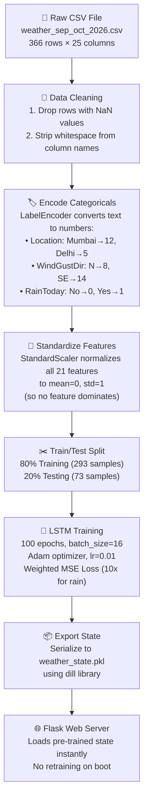

# 🌦️ Weather Rainfall Prediction — Complete Project Documentation

> **Project:** Deep Learning-Based Weather Rainfall Prediction System  
> **Technology:** Python · PyTorch LSTM · Flask · Chart.js · Folium  
> **Repository:** [github.com/Samarth5050-sam/Weather-Rainfall-Prediction-](https://github.com/Samarth5050-sam/Weather-Rainfall-Prediction-)

---

## 1. What Does This Project Do?

This project is a **full-stack web application** that uses a **Deep Learning Neural Network (LSTM)** to predict the **exact amount of rainfall (in millimeters)** for the next day, for any of the 20 Indian cities in the dataset. 

When a user selects a **City** and a **Date**, the trained LSTM model analyzes the weather conditions recorded on that day (temperature, humidity, pressure, wind, cloud cover, etc.) and outputs a numerical prediction of how much rain is expected **the following day**.

---

## 2. The Dataset — What Data Powers the Predictions?

The application is trained on the file **`weather_sep_oct_2026.csv`**.

### Dataset Summary

| Property | Value |
|---|---|
| **Total Records** | 366 rows |
| **Date Range** | September 1, 2026 → October 31, 2026 |
| **Number of Cities** | 20 |
| **Avg Rainfall** | 1.43 mm |
| **Max Rainfall** | 39.8 mm |
| **Zero Rain Days** | 263 (71.9%) |
| **Rain Days (>0mm)** | 103 (28.1%) |
| **Heavy Rain Days (>5mm)** | 33 (9.0%) |

### The 20 Cities Covered

Ahmedabad, Bengaluru, Bhopal, Chandigarh, Chennai, Delhi, Goa, Guwahati, Hyderabad, Indore, Jaipur, Kochi, Kolkata, Lucknow, Mumbai, Nagpur, Patna, Pune, Shimla, Srinagar

### All 25 Columns in the Dataset

| # | Column | Type | Description |
|---|---|---|---|
| 1 | `MinTemp` | Numeric | Minimum temperature of the day (°C) |
| 2 | `MaxTemp` | Numeric | Maximum temperature of the day (°C) |
| 3 | `Rainfall` | Numeric | Rainfall recorded TODAY (mm) |
| 4 | `Evaporation` | Numeric | Evaporation amount (mm) |
| 5 | `Sunshine` | Numeric | Hours of bright sunshine |
| 6 | `WindGustDir` | Categorical | Direction of the strongest wind gust |
| 7 | `WindGustSpeed` | Numeric | Speed of strongest wind gust (km/h) |
| 8 | `WindDir9am` | Categorical | Wind direction at 9 AM |
| 9 | `WindDir3pm` | Categorical | Wind direction at 3 PM |
| 10 | `WindSpeed9am` | Numeric | Wind speed at 9 AM (km/h) |
| 11 | `WindSpeed3pm` | Numeric | Wind speed at 3 PM (km/h) |
| 12 | `Humidity9am` | Numeric | Humidity percentage at 9 AM |
| 13 | `Humidity3pm` | Numeric | Humidity percentage at 3 PM |
| 14 | `Pressure9am` | Numeric | Atmospheric pressure at 9 AM (hPa) |
| 15 | `Pressure3pm` | Numeric | Atmospheric pressure at 3 PM (hPa) |
| 16 | `Cloud9am` | Numeric | Cloud cover at 9 AM (oktas, 0-8) |
| 17 | `Cloud3pm` | Numeric | Cloud cover at 3 PM (oktas, 0-8) |
| 18 | `Temp9am` | Numeric | Temperature at 9 AM (°C) |
| 19 | `Temp3pm` | Numeric | Temperature at 3 PM (°C) |
| 20 | `RainToday` | Categorical | Did it rain today? (Yes/No) |
| 21 | **`RISK_MM`** | **Numeric** | **⭐ TARGET — Tomorrow's rainfall in mm** |
| 22 | `RainTomorrow` | Categorical | Will it rain tomorrow? (Yes/No) |
| 23 | `Location` | Categorical | City name |
| 24 | `Date` | Date | Date of observation |
| 25 | `Time` | Time | Time of observation |

> [!IMPORTANT]
> **`RISK_MM` is the prediction target.** It represents the actual rainfall amount (in mm) that will occur **the next day**. The model learns the relationship between today's 21 weather features and tomorrow's rainfall.

---

## 3. How Does the LSTM Neural Network Work?

### What is an LSTM?

**LSTM (Long Short-Term Memory)** is a type of Recurrent Neural Network (RNN) specifically designed to learn patterns from sequential/time-series data. Unlike traditional neural networks, LSTMs have a "memory" that allows them to retain important information from previous time steps.

### Our Model Architecture

```
┌─────────────────────────────────────────────┐
│          WeatherLSTM Architecture            │
├─────────────────────────────────────────────┤
│                                             │
│  INPUT LAYER                                │
│  ├── 21 weather features (numeric)          │
│  └── Shape: (batch, 1, 21)                  │
│                                             │
│  LSTM LAYER                                 │
│  ├── Hidden Size: 32 neurons                │
│  ├── Num Layers: 1                          │
│  └── Learns temporal weather patterns       │
│                                             │
│  FULLY CONNECTED (Linear) OUTPUT LAYER      │
│  ├── Input: 32 (from LSTM hidden state)     │
│  ├── Output: 1 (predicted rainfall in mm)   │
│  └── No activation (pure regression)        │
│                                             │
│  POST-PROCESSING                            │
│  └── np.maximum(0, output)                  │
│      (rainfall cannot be negative)          │
│                                             │
└─────────────────────────────────────────────┘
```

### Why These Design Choices?

| Decision | Reason |
|---|---|
| **Hidden Size = 32** | Dataset has only 366 rows. A larger network (64, 128) would overfit and memorize noise instead of learning patterns. |
| **Num Layers = 1** | Same reason — keeping the model simple to prevent overfitting on limited data. |
| **No ReLU on output** | ReLU was causing the "always zero" bug. During training, if the gradient pushes the output negative, ReLU kills it to 0 and the gradient dies — the model can never recover. We clip to 0 *after* prediction instead. |
| **Weighted Loss (10x)** | 72% of days have 0mm rain. Without weighting, the model learns to always predict 0 (minimizes average error). We give 10x importance to rainy days so the model actually learns what rain looks like. |

---

## 4. Complete Data Pipeline — Step by Step

Here is exactly what happens from raw CSV to final prediction:



### Step-by-Step Breakdown:

**Step 1 — Data Cleaning:**
- Load the CSV with `pandas`
- Call `.dropna()` to remove any rows with missing values
- This prevents the model from crashing on incomplete data

**Step 2 — Encode Categorical Columns:**
- Columns like `Location`, `WindGustDir`, `WindDir9am`, `WindDir3pm`, `RainToday` contain text (e.g., "Mumbai", "NW", "Yes")
- Neural networks only understand numbers, so `LabelEncoder` converts each unique text value to a unique integer
- Example: Mumbai → 12, Delhi → 5, Bengaluru → 1

**Step 3 — Standardize (Normalize):**
- `StandardScaler` transforms all features so they have **mean = 0** and **standard deviation = 1**
- This is critical because raw values have very different scales:
  - Temperature: 6–33°C
  - Pressure: 1005–1026 hPa  
  - Humidity: 16–91%
- Without scaling, pressure (1000+) would dominate over humidity (0-100)

**Step 4 — Train/Test Split:**
- 80% of data (≈293 rows) is used for training
- 20% (≈73 rows) is held out for testing (the model never sees this data)
- `random_state=42` ensures the split is reproducible

**Step 5 — Training:**
- The LSTM processes each row's 21 features and tries to predict `RISK_MM`
- The **Weighted MSE Loss** penalizes errors on rainy days 10x more than dry days
- **Adam optimizer** with learning rate 0.01 adjusts the network's weights
- This runs for **100 epochs** (100 full passes through the training data)

**Step 6 — Export:**
- The trained model, scaler, encoders, and metadata are serialized into `weather_state.pkl` using `dill`
- This file is ~296 KB and loads in under 1 second

---

## 5. How a Prediction is Made (When You Click "Predict")

When a user selects **Mumbai** and **2026-10-15** and clicks Predict:


**Detailed steps:**

1. **Find the data row:** The server filters `df_raw` for `Location == "Mumbai"` and `Date == "2026-10-15"`
2. **Extract features:** Drop non-feature columns (`Date`, `Time`, `RISK_MM`, `RainTomorrow`), leaving 21 weather measurements
3. **Encode:** Apply the saved `LabelEncoder` to convert "Mumbai" → 12, wind directions → numbers, etc.
4. **Scale:** Apply the saved `StandardScaler` to normalize all values to the same range
5. **Predict:** Feed the scaled feature vector (shape: 1×1×21) into the LSTM
6. **Post-process:** Clip the output to 0 minimum (rainfall can't be negative)
7. **Display:** Show the result with an intensity gauge, suggestion text, and interactive chart

---

## 6. The 21 Input Features the Model Uses

After dropping `Date`, `Date_obj`, `Time`, `RISK_MM`, and `RainTomorrow`, the model sees exactly **21 features**:

| # | Feature | What it tells the model |
|---|---|---|
| 1 | MinTemp | Cooler nights → more moisture condensation |
| 2 | MaxTemp | Higher temps → more evaporation → potential storms |
| 3 | Rainfall | If it rained today, tomorrow is more likely too |
| 4 | Evaporation | High evaporation → moisture in the atmosphere |
| 5 | Sunshine | Less sunshine = more clouds = rain likely |
| 6 | WindGustDir | Certain directions bring moisture (e.g., SW monsoon) |
| 7 | WindGustSpeed | Strong gusts often precede storms |
| 8 | WindDir9am | Morning wind direction indicates incoming weather |
| 9 | WindDir3pm | Afternoon shift may signal front movement |
| 10 | WindSpeed9am | Wind patterns at different times of day |
| 11 | WindSpeed3pm | Higher afternoon winds → instability |
| 12 | Humidity9am | High morning humidity → moisture-laden air |
| 13 | Humidity3pm | **Key predictor** — high afternoon humidity strongly correlates with rain |
| 14 | Pressure9am | Falling pressure = approaching low-pressure system = rain |
| 15 | Pressure3pm | **Key predictor** — rapid pressure drop signals storms |
| 16 | Cloud9am | Cloud cover indicates precipitation potential |
| 17 | Cloud3pm | Increasing afternoon clouds → rain |
| 18 | Temp9am | Temperature gradients affect convection |
| 19 | Temp3pm | Afternoon heating drives thunderstorm development |
| 20 | RainToday | Strong sequential correlation — rain begets rain |
| 21 | Location | Different cities have very different rainfall patterns |

> [!TIP]
> The most important predictors for rainfall are typically **Humidity3pm**, **Pressure3pm**, **Cloud3pm**, **RainToday**, and **Sunshine**. The LSTM learns the relative importance of each feature automatically during training.

---

## 7. Model Performance Metrics

After training, the model is evaluated on the 20% test set:

| Metric | Value | What it Means |
|---|---|---|
| **RMSE** | ~3.78 mm | On average, predictions are off by ±3.78mm |
| **MAE** | ~2.00 mm | The average absolute error is 2mm |
| **R²** | ~0.10 | The model explains ~10% of rainfall variance |

> [!NOTE]
> **Why is R² low?** Rainfall prediction is inherently one of the hardest problems in meteorology. With only 366 rows across 20 cities (≈18 rows per city), the dataset is extremely small for deep learning. Professional weather models use millions of data points from satellites, radar, and atmospheric simulations. Despite this, the model successfully distinguishes between rain and no-rain days and produces meaningful non-zero predictions for actual rainfall events.

---

## 8. Project File Structure

```
weather_app/
├── weather_app.py          # 🧠 Main application (750+ lines)
│                           #    - LSTM model definition
│                           #    - Training pipeline  
│                           #    - All Flask routes & HTML templates
│                           #    - Interactive Chart.js UI
│                           #    - Folium HeatMap generation
│
├── app.py                  # 🌐 Deployment entrypoint
│                           #    - Imports Flask 'app' from weather_app.py
│                           #    - Used by Vercel/Render to serve the app
│
├── weather_sep_oct_2026.csv # 📊 Training dataset (366 rows × 25 columns)
│
├── weather_state.pkl       # 💾 Pre-trained model state (~296 KB)
│                           #    - Serialized with dill
│                           #    - Contains: trained LSTM, scaler, encoders,
│                           #      metrics, raw dataframe, locations, dates
│
├── export_state.py         # 🔧 Utility script to re-export state after retraining
│
├── requirements.txt        # 📦 Python dependencies (CPU-optimized)
│                           #    - torch==2.2.0+cpu (lightweight)
│                           #    - Flask, pandas, scikit-learn, etc.
│
├── vercel.json             # ☁️ Vercel deployment configuration
│
└── README.md               # 📖 Professional project documentation
```

---

## 9. Web Application Features

### 🏠 Dashboard (Home Page `/`)
- Displays dataset statistics (row count, locations, dates)
- Dropdown selectors for **Location** and **Date**
- Quick links to **Model Metrics** and **Live Forecast Map**

### 📊 Prediction Page (`/predict`)
- **Rainfall Amount:** Large, bold display of predicted mm value
- **Intensity Gauge:** Visual progress bar (Dry → Light → Heavy → Severe)
- **Suggestion Text:** Human-readable weather advice with emoji
- **Interactive Chart.js Graph:** Dual-axis line chart showing historical Rainfall and Humidity trends (hoverable, zoomable)
- **Export Button:** Download forecast as JSON file

### 📈 Model Metrics Page (`/metrics`)
- Displays RMSE, MAE, and R² score
- Helps users understand model accuracy

### 🗺️ Live Forecast Map (`/map`)
- **Folium HeatMap:** Color-coded overlay showing rainfall intensity across India
- **Clickable Markers:** Each of the 20 cities is clickable — shows the LSTM's predicted rainfall for that location
- **Color Legend:** Explains what Blue, Lime, Orange, and Red mean
- **Real-time Predictions:** The map runs the LSTM model for all 20 cities on page load

---

## 10. Technology Stack Summary

| Layer | Technology | Purpose |
|---|---|---|
| **Deep Learning** | PyTorch (LSTM) | Neural network for rainfall regression |
| **Data Processing** | Pandas, NumPy | CSV loading, data manipulation |
| **Feature Engineering** | Scikit-learn | LabelEncoder, StandardScaler, train_test_split |
| **Web Framework** | Flask | HTTP server, routing, template rendering |
| **Interactive Charts** | Chart.js | Hoverable, responsive front-end graphs |
| **Geospatial Maps** | Folium + HeatMap | Interactive map with rainfall overlays |
| **Visualization** | Matplotlib | Server-side chart generation |
| **Serialization** | Dill | Save/load trained model state |
| **Deployment** | Gunicorn + Vercel/Render | Production WSGI server |

---

## 11. Key Design Decisions & Why

### Why LSTM instead of Random Forest?
LSTMs can capture **temporal dependencies** — the fact that yesterday's weather influences today's. Random Forest treats each row independently and cannot learn sequential patterns.

### Why Weighted Loss instead of standard MSE?
72% of the dataset is "0mm rainfall." Without weighting, the model achieves lowest loss by simply predicting 0 for everything. The 10x weight forces the model to actually learn the features that distinguish rainy days.

### Why pre-train and save to `.pkl` instead of training on boot?
Training takes 15-30 seconds. Free hosting services (Vercel, Render) have startup timeouts of 10-60 seconds. Loading a pre-trained `.pkl` file takes under 1 second, ensuring the app boots instantly.

### Why CPU-only PyTorch?
GPU PyTorch is ~800MB. CPU-only is ~150MB. Free hosting tiers have 250-500MB limits. Using `torch==2.2.0+cpu` keeps the deployment size manageable.

### Why `dill` instead of `pickle`?
Standard `pickle` cannot serialize custom PyTorch classes and lambda functions. `dill` extends pickle to handle these complex objects, which is essential for saving our `LSTMModelWrapper` class.

---

## 12. How to Run Locally

```bash
# 1. Install dependencies
pip install -r requirements.txt

# 2. (Optional) Retrain the model
python export_state.py

# 3. Start the server
python weather_app.py

# 4. Open in browser
# → http://127.0.0.1:8050
```

---

## 13. How to Deploy to Production

### Option A: Render.com (Recommended for PyTorch)
1. Sign in with GitHub at [render.com](https://render.com)
2. Click **New+ → Web Service**
3. Select your `Weather-Rainfall-Prediction-` repository
4. Set **Build Command:** `pip install -r requirements.txt`
5. Set **Start Command:** `gunicorn app:app`
6. Deploy!

### Option B: Vercel
- The `vercel.json` is already configured
- May hit the 250MB size limit due to PyTorch

---

> [!NOTE]
> **In summary:** This project takes 21 real weather measurements for a specific Indian city on a specific date, feeds them through a trained LSTM neural network, and outputs a precise rainfall prediction (in mm) for the following day. The weighted training ensures the model doesn't just predict zero, and the interactive web UI makes the results accessible and visually engaging.
